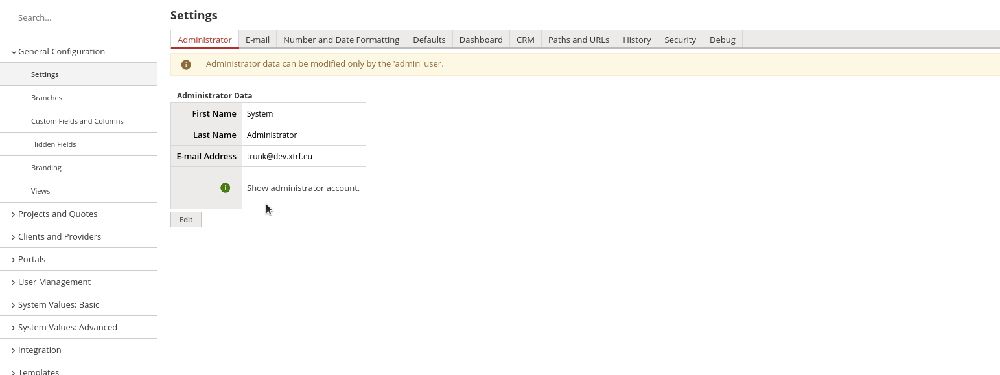

# XTRF Summit 2020
## How to install Custom Column:
- Go to Settings ⚙️,
- In General Settings tab select "Custom Fields and Columns",
- Go to "Custom Columns" tab,
- Click on "Add Custom Column" button.

## What's what? 
- Keyword `unwrappedThis` refers to the processed entity (the one selected from dropdown Class Name). 
- Column will display whatever is returned from the code - explicitly by using `return` keyword or implicitly by returning the last line. 